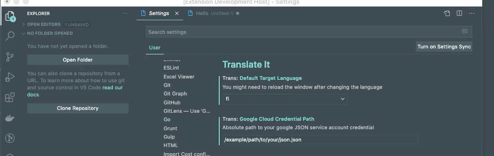

# Translate-it README

A little extension for translating English text to any language that google translate supports (default to Finnish) in VSCode without having to open a browser, just for convenience.

## Features

Translate selected text(s) into your selected target language ( default is Finnish)



## Requirements

- Go to your Google Cloud Console, create a new project or use an existing project, enable Google Cloud Translate API
- Download google [service account](https://cloud.google.com/iam/docs/creating-managing-service-accounts) JSON file and store somewhere safe in your machine

## Extension Settings

- In the Settings(UI), open Extensions/Translate It and paste in the absolute path of the account service JSON file that you've just downloaded.

- Or in the `settings.json` of vscode, paste the path in the setting:

```json
"trans.googleCloudCredentialPath": "path/to/credential/file.json"
```

## How to install

- This extension is not published yet in Extension Market.
- To install, download `translate-it-0.0.1.vsix` file from this repo.
- Run `code --install-extension translate-it-0.0.1.vsix`

## How to use

- Select/highlight the piece(s) of texts that you want to translate, then press `Cmd + F1` on MacOs or `Ctrl + F1` on Windows and Linux.
- You can also open the command palette and find command `Finnish It!`
- Translated texts will appear in a pop-up modal, you can copy and paste the translated text whereever you want it to be, or replace the original text with the translated one immediate.

**Enjoy!**
